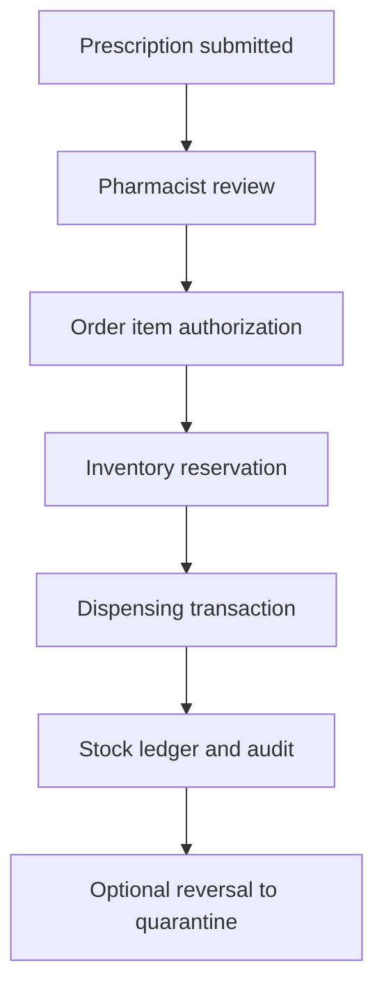

# Thandizo System Architecture

## Purpose and status

Thandizo is a modular healthcare and pharmacy operations platform. The active hardening line provides tested authorization, transaction, inventory and dispensing controls, but the repository is not independently certified for production healthcare use.

## System layers

| Layer | Main components | Responsibility |
| --- | --- | --- |
| Web client | React, Vite, TanStack Query, service worker | Role-based user journeys and resilient web delivery |
| API | Express, TypeScript, Zod | Request validation, authentication and workflow orchestration |
| Domain services | Authorization, orders, prescriptions, inventory, payments, audit, notifications | Business and safety invariants |
| Persistence | PostgreSQL/Neon, shared schema, ordered SQL migrations | Durable operational and audit state |
| Deployment adapters | Persistent Node server and Vercel serverless entry | Runtime integration and health/readiness surfaces |

## Trust boundaries

1. **Public client boundary** — browser input is untrusted; the API re-validates every request.
2. **Authentication boundary** — bearer credentials are verified, expired/revoked sessions are denied, and privileged role creation is restricted.
3. **Authorization boundary** — permissions, ownership, patient scope and branch scope are enforced server-side.
4. **Emergency boundary** — break-glass access requires a persisted, justified, expiring grant and produces audit evidence.
5. **Data boundary** — production persistence uses PostgreSQL; in-memory storage is limited to development/test scenarios.
6. **External provider boundary** — payment, email and other integrations are treated as unreliable and must be idempotent and observable.

## Core workflows

### Prescription to dispensing

Dispensing, reservation and ledger changes must commit atomically. Reversal never restores returned medicine directly to saleable stock.

### Protected data access

Every sensitive request passes authentication, permission and ownership/scope checks. Emergency access is an explicit additional path, not a bypass hidden inside normal authorization.

## Data integrity

- Ordered migrations introduce role, audit, account-state, referential, inventory, reservation, dispensing and credential controls.
- Quantity and state transitions are validated in domain logic and database constraints where available.
- Idempotency keys protect operations that could otherwise duplicate stock or financial effects.
- Audit events record actor, action, entity, correlation and outcome without storing secret/request payloads.

## Deployment topology

### Recommended production

- Static client on a CDN/edge platform.
- Persistent Node API on an authenticated managed runtime.
- Managed PostgreSQL with backups, point-in-time recovery and restricted network access.
- Centralized logs/metrics and external health/readiness monitoring.
- Protected staging and production secret stores.

### Vercel preview/serverless

The repository builds a Vercel API adapter for review deployments. Serverless instances do not share in-memory rate limits, caches, background jobs or WebSocket state. These limitations must be resolved through shared infrastructure or a persistent API before high-assurance production operation.

## Security design

- Strict input schemas and request-size limits.
- Security headers, origin allow-list and rate limiting.
- Independent secrets for authentication and patient-data encryption.
- Route-security register and automated authorization regression tests.
- Immutable audit controls for sensitive operational evidence.
- Secret, dependency and static-analysis gates in GitHub Actions.

## Known architecture risks

- A public repository previously contained environment configuration; exposed credentials must be rotated and history handled through a coordinated incident process.
- In-memory controls do not provide distributed enforcement across serverless replicas.
- Clinical decision-support rules require qualified validation and controlled source data.
- Payment provider abstractions require production provider certification, signed webhooks and reconciliation.
- Regulatory, privacy, retention and disaster-recovery requirements require independent approval.

