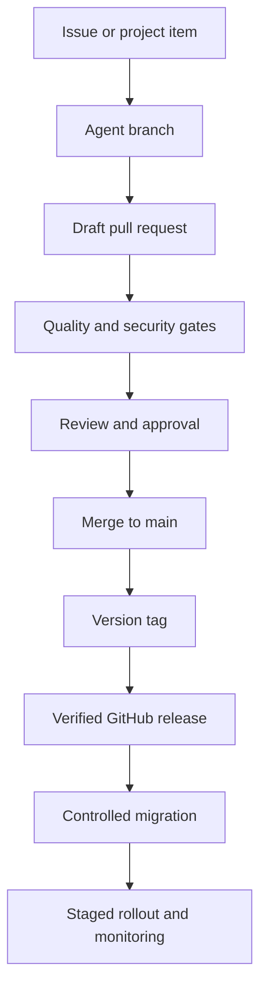

# Thandizo Healthcare Management System

[](https://github.com/Chrispine-1210/Health-Care-Management-System/actions/workflows/ci.yml)
[](https://github.com/Chrispine-1210/Health-Care-Management-System/actions/workflows/security.yml)

Thandizo is a TypeScript healthcare and pharmacy operations platform designed for the Malawian market. It combines prescription workflows, branch-level inventory, order fulfilment, payments, delivery coordination, role-based access and auditable clinical operations in one codebase.

> **Pre-production status:** this repository is under active hardening. It is not certified as a medical device, pharmacy regulatory system, or data-protection compliance solution. Do not process real patient data until the release gates, infrastructure review, credential rotation and regulatory assessment are complete.

## Current delivery posture

| Area | Current state | Release expectation |
| --- | --- | --- |
| Web/PWA | Implemented | Validate browser, offline and cache behaviour in staging |
| Express API | Implemented | Deploy with PostgreSQL and production secrets |
| Vercel preview | Supported through a serverless adapter | Use for review; persistent Node hosting is preferred for high-assurance production operations |
| Desktop shell | Electron source present | Packaging and signing are not currently automated |
| Native Android/iOS | Not implemented | PWA only; do not represent it as a native application |
| Automated tests | Authorization, transactions, audit, payment and safety workflows covered | All tests must pass before merge or release |
| Production certification | Not completed | Independent security, privacy, clinical-safety and regulatory review required |

## Operational capabilities

- Multi-role access for administrators, pharmacists, staff, customers and drivers.
- Multi-branch product, batch, expiry and stock management.
- Inventory reservation, stock movement ledger and controlled adjustments.
- Prescription review, dispensing, batch substitution and dispensing reversal.
- Quarantine handling for returned medicine so reversed stock is not silently resold.
- Orders, cancellations, payments, deliveries and appointment workflows.
- Emergency-access grants with expiry, justification and audit evidence.
- Immutable audit-log controls and correlation-aware structured logging.
- Health and readiness probes for deployment monitoring.
- Malawi-oriented Airtel Money and TNM Mpamba payment abstractions.

## Safety and security invariants

The following rules are release blockers:

1. A user may access only records allowed by their role, ownership and branch scope.
2. Patient-data access requires authorization or a valid, time-limited emergency-access grant.
3. Stock changes, dispensing, reversals and substitutions must remain transactional and auditable.
4. Returned medication must enter quarantine and must not restore saleable stock automatically.
5. Every sensitive operation must produce a non-secret audit event without logging patient payloads.
6. Secrets, production credentials and real patient data must never be committed to Git.
7. Database migrations must run once through a controlled environment, never automatically from every preview build.

See [SECURITY.md](SECURITY.md), [Quality Gates](docs/QUALITY_GATES.md) and [Release Process](docs/RELEASE_PROCESS.md).

## Architecture

| Layer | Technology | Responsibility |
| --- | --- | --- |
| Client | React 18, TypeScript, Vite, TanStack Query, Tailwind | Role-specific web/PWA experiences |
| API | Express, TypeScript, Zod | Authentication, authorization and operational workflows |
| Data | PostgreSQL/Neon, Drizzle schemas, ordered SQL migrations | Durable business, inventory and audit records |
| Security | Bearer authentication, permissions, revocation, emergency access, encryption and audit services | Access enforcement and evidence |
| Delivery | Vercel adapter or persistent Node runtime | Preview and production execution surfaces |

Detailed boundaries and data flows are documented in [ARCHITECTURE.md](ARCHITECTURE.md).

## Local development

### Prerequisites

- Node.js 24
- npm with lockfile support
- PostgreSQL for database-backed workflows

### Setup

```bash
git clone https://github.com/Chrispine-1210/Health-Care-Management-System.git
cd Health-Care-Management-System
cp env.example .env
npm ci
npm run migration:check
npm run db:migrate
npm run dev
```

Use synthetic test data only. Replace every placeholder in `.env`; never reuse staging or production secrets locally.

### Required commands

| Command | Purpose |
| --- | --- |
| `npm run dev` | Start the development server |
| `npm run check` | Run TypeScript validation |
| `npm test` | Run automated tests |
| `npm run route-security:check` | Verify the route-security register is current |
| `npm run migration:check` | Validate ordered, immutable migration files |
| `npm run build` | Build client, service worker, Node server and Vercel adapter |
| `npm audit --omit=dev --audit-level=high` | Block high/critical runtime dependency vulnerabilities |
| `npm run db:migrate` | Apply pending migrations to the explicitly configured database |

Before opening a pull request, run:

```bash
npm run check
npm test
npm run migration:check
npm run route-security:check
npm run build
```

## Environment configuration

Start from `env.example`. Production requires, at minimum:

- `DATABASE_URL`
- `JWT_SECRET`
- `PATIENT_DATA_ENCRYPTION_KEY`
- `ALLOWED_ORIGINS`
- `VITE_API_BASE_URL`
- `USE_DATABASE_STORAGE=true`

Store secrets in the hosting provider or protected GitHub Environment. `JWT_SECRET` and `PATIENT_DATA_ENCRYPTION_KEY` must be independent high-entropy values. See [DEPLOYMENT.md](DEPLOYMENT.md).

## Health and readiness

- `GET /health` confirms the process and router are alive.
- `GET /ready` checks required configuration and database reachability, returning `503` when the service should not receive traffic.

Monitoring should probe both endpoints and alert on readiness failures, elevated error rates and latency.

## GitHub delivery workflow



- Work starts from a prioritized issue and an `agent/<scope>` branch.
- Pull requests remain draft until required checks pass and rollback evidence is present.
- Releases use semantic tags such as `v1.2.0`; the tag must match `package.json`.
- Database migrations run through the manual migration workflow and a protected `staging` or `production` environment.
- Production rollout requires an approved change window, backup/restore evidence and post-deployment monitoring.

See [Project Governance](docs/PROJECT_GOVERNANCE.md) for priorities, board states and definition of done.

## Project documents

- [Security policy](SECURITY.md)
- [Contribution guide](CONTRIBUTING.md)
- [Architecture](ARCHITECTURE.md)
- [Testing](TESTING.md)
- [Deployment](DEPLOYMENT.md)
- [Quality gates](docs/QUALITY_GATES.md)
- [Release process](docs/RELEASE_PROCESS.md)
- [Project governance](docs/PROJECT_GOVERNANCE.md)
- [Changelog](CHANGELOG.md)

## Responsible use

This software supports pharmacy operations; it does not replace professional clinical judgment. Drug-interaction and decision-support outputs must be reviewed by a licensed professional. Never use demo data, AI output or automated status changes as the sole basis for dispensing medication.

